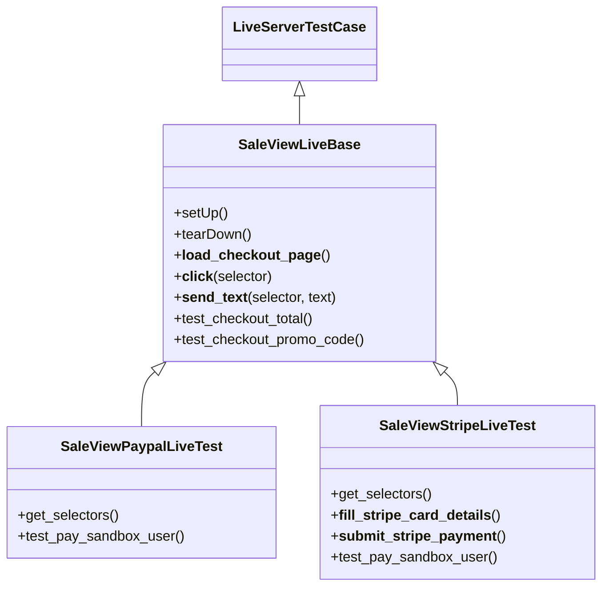

# Design: Refactor Sale Live Tests

## Class Hierarchy



## Implementation Details

### `SaleViewLiveBase`
- Move all generic selenium setup to `setUp`.
- Implement `test_checkout_total` and `test_checkout_promo_code` using `self.selectors['amount']`.
- Provide a hook or requirement for `self.selectors` to be initialized.

### `SaleViewPaypalLiveTest`
- Class-level `@override_settings(PAYMENT_PROVIDER="paypal")`.
- `setUp` calls `super().setUp()` and then defines the PayPal selectors:
    ```python
    self.selectors = {
        "amount": "header button > span",
        "login_btn": "p + button",
        "input_email": "#email",
        "next_btn": "button",
        "input_pass": "#password",
        "submit_btn": "#btnLogin",
        "pay_btn": '[data-id="payment-submit-btn"]',
    }
    ```
- Implement `test_pay_sandbox_user_paypal` (renamed to `test_pay_sandbox_user`).

### `SaleViewStripeLiveTest`
- Class-level `@override_settings(PAYMENT_PROVIDER="stripe")`.
- `setUp` calls `super().setUp()` and then defines the Stripe selectors:
    ```python
    self.selectors = {
        "amount": "header button > span",
    }
    ```
- Move `__fill_stripe_card_details__` and `__submit_stripe_payment__` here.
- Implement `test_pay_stripe_sandbox_user` (renamed to `test_pay_sandbox_user`).

## Duplicated test names in current code
The current code has two `test_checkout_promo_code` methods in the same class (lines 598 and 620). Splitting into separate classes naturally solves this and ensures both are executed.
